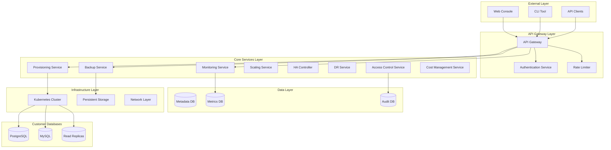

# Design Document: Enterprise DBaaS Platform

## Overview

The Enterprise Database-as-a-Service (DBaaS) Platform is designed as a cloud-native, microservices-based system built in Go that provides comprehensive database lifecycle management. The platform follows the database-per-service pattern for internal services while managing customer databases through a unified control plane.

The architecture leverages Kubernetes operators for database automation, implements enterprise-grade security and compliance features, and provides horizontal scalability through a distributed microservices design. The system is designed to compete with Oracle's DBaaS offerings by providing superior automation, cost optimization, and developer experience.

## Architecture

### High-Level Architecture



### Microservices Architecture

The platform follows a microservices architecture with the following key principles:
- **Database per Service**: Each microservice owns its dedicated database
- **API-First Design**: All services communicate through well-defined REST APIs
- **Event-Driven Communication**: Asynchronous communication using message queues
- **Circuit Breaker Pattern**: Fault tolerance and resilience
- **Service Mesh**: Istio for service-to-service communication and security

### Deployment Architecture

The platform is designed for deployment on Kubernetes with the following characteristics:
- **Multi-Region Support**: Active-active deployment across multiple regions
- **Auto-Scaling**: Horizontal Pod Autoscaler (HPA) and Vertical Pod Autoscaler (VPA)
- **Blue-Green Deployments**: Zero-downtime deployments
- **Canary Releases**: Gradual rollout of new features

## Components and Interfaces

### API Gateway Service

**Responsibilities:**
- Request routing and load balancing
- Authentication and authorization
- Rate limiting and throttling
- Request/response transformation
- API versioning support

**Key Interfaces:**
```go
type APIGateway interface {
    RouteRequest(ctx context.Context, req *http.Request) (*http.Response, error)
    ValidateAuth(ctx context.Context, token string) (*AuthContext, error)
    ApplyRateLimit(ctx context.Context, clientID string) error
    LogRequest(ctx context.Context, req *RequestLog) error
}

type RequestLog struct {
    RequestID   string
    ClientID    string
    Method      string
    Path        string
    StatusCode  int
    Duration    time.Duration
    Timestamp   time.Time
}
```

### Provisioning Service

**Responsibilities:**
- Database instance creation and deletion
- Configuration management
- Resource allocation
- Template management for different database engines

**Key Interfaces:**
```go
type ProvisioningService interface {
    CreateDatabase(ctx context.Context, req *CreateDatabaseRequest) (*DatabaseInstance, error)
    DeleteDatabase(ctx context.Context, instanceID string) error
    UpdateConfiguration(ctx context.Context, instanceID string, config *DatabaseConfig) error
    GetDatabaseStatus(ctx context.Context, instanceID string) (*DatabaseStatus, error)
}

type CreateDatabaseRequest struct {
    TenantID       string
    Engine         DatabaseEngine
    Version        string
    InstanceSize   InstanceSize
    StorageSize    int64
    BackupEnabled  bool
    HAEnabled      bool
    Configuration  map[string]interface{}
}

type DatabaseInstance struct {
    ID             string
    TenantID       string
    Engine         DatabaseEngine
    Status         InstanceStatus
    Endpoint       string
    CreatedAt      time.Time
    Configuration  *DatabaseConfig
}
```

### Backup Service

**Responsibilities:**
- Automated backup scheduling
- Point-in-time recovery
- Backup retention management
- Cross-region backup replication

**Key Interfaces:**
```go
type BackupService interface {
    CreateBackup(ctx context.Context, instanceID string) (*Backup, error)
    RestoreBackup(ctx context.Context, backupID string, targetInstanceID string) error
    ListBackups(ctx context.Context, instanceID string) ([]*Backup, error)
    DeleteBackup(ctx context.Context, backupID string) error
    ScheduleBackup(ctx context.Context, instanceID string, schedule *BackupSchedule) error
}

type Backup struct {
    ID           string
    InstanceID   string
    Type         BackupType
    Status       BackupStatus
    Size         int64
    CreatedAt    time.Time
    ExpiresAt    time.Time
    Encrypted    bool
    Checksum     string
}

type BackupSchedule struct {
    CronExpression string
    RetentionDays  int
    BackupType     BackupType
}
```

### Monitoring Service

**Responsibilities:**
- Real-time metrics collection
- Performance monitoring
- Health checks
- Alert generation

**Key Interfaces:**
```go
type MonitoringService interface {
    CollectMetrics(ctx context.Context, instanceID string) (*MetricsSnapshot, error)
    GetMetricsHistory(ctx context.Context, instanceID string, timeRange TimeRange) ([]*MetricsSnapshot, error)
    CreateAlert(ctx context.Context, alert *AlertRule) error
    EvaluateAlerts(ctx context.Context, instanceID string) ([]*Alert, error)
}

type MetricsSnapshot struct {
    InstanceID      string
    Timestamp       time.Time
    CPUUtilization  float64
    MemoryUsage     int64
    DiskIOPS        int64
    ConnectionCount int32
    QueryLatency    time.Duration
    CustomMetrics   map[string]float64
}

type AlertRule struct {
    ID          string
    InstanceID  string
    MetricName  string
    Threshold   float64
    Operator    ComparisonOperator
    Duration    time.Duration
    Severity    AlertSeverity
}
```

### High Availability Controller

**Responsibilities:**
- Cluster management
- Automatic failover
- Read replica management
- Load balancing

**Key Interfaces:**
```go
type HAController interface {
    CreateCluster(ctx context.Context, req *CreateClusterRequest) (*DatabaseCluster, error)
    AddReplica(ctx context.Context, clusterID string, config *ReplicaConfig) (*Replica, error)
    PromoteReplica(ctx context.Context, replicaID string) error
    PerformFailover(ctx context.Context, clusterID string) error
    GetClusterStatus(ctx context.Context, clusterID string) (*ClusterStatus, error)
}

type DatabaseCluster struct {
    ID          string
    PrimaryID   string
    Replicas    []*Replica
    Status      ClusterStatus
    CreatedAt   time.Time
    UpdatedAt   time.Time
}

type Replica struct {
    ID           string
    ClusterID    string
    Type         ReplicaType
    Status       ReplicaStatus
    Endpoint     string
    LagBytes     int64
    LastSync     time.Time
}
```

### Access Control Service

**Responsibilities:**
- User authentication and authorization
- Role-based access control (RBAC)
- Multi-tenant isolation
- Audit logging

**Key Interfaces:**
```go
type AccessControlService interface {
    Authenticate(ctx context.Context, credentials *Credentials) (*AuthToken, error)
    Authorize(ctx context.Context, token string, resource string, action string) error
    CreateUser(ctx context.Context, user *User) error
    AssignRole(ctx context.Context, userID string, roleID string, tenantID string) error
    LogAccess(ctx context.Context, log *AccessLog) error
}

type User struct {
    ID          string
    Email       string
    TenantID    string
    Roles       []*Role
    CreatedAt   time.Time
    LastLogin   time.Time
    Active      bool
}

type Role struct {
    ID          string
    Name        string
    Permissions []*Permission
    TenantID    string
}

type Permission struct {
    Resource string
    Actions  []string
}
```

## Data Models

### Core Domain Models

```go
// Database Engine Types
type DatabaseEngine string

const (
    PostgreSQL DatabaseEngine = "postgresql"
    MySQL      DatabaseEngine = "mysql"
)

// Instance Configuration
type DatabaseConfig struct {
    Engine          DatabaseEngine
    Version         string
    Parameters      map[string]interface{}
    ConnectionLimits *ConnectionLimits
    SecurityConfig  *SecurityConfig
}

type ConnectionLimits struct {
    MaxConnections     int32
    MaxIdleConnections int32
    ConnMaxLifetime    time.Duration
}

type SecurityConfig struct {
    TLSEnabled         bool
    EncryptionAtRest   bool
    CustomerManagedKey string
    NetworkACL         []string
}

// Tenant and Multi-tenancy
type Tenant struct {
    ID              string
    Name            string
    SubscriptionTier SubscriptionTier
    ResourceLimits  *ResourceLimits
    CreatedAt       time.Time
    Active          bool
}

type ResourceLimits struct {
    MaxInstances    int32
    MaxStorage      int64
    MaxBackups      int32
    MaxConnections  int32
}

// Operational Models
type InstanceStatus string

const (
    StatusProvisioning InstanceStatus = "provisioning"
    StatusRunning      InstanceStatus = "running"
    StatusStopped      InstanceStatus = "stopped"
    StatusMaintenance  InstanceStatus = "maintenance"
    StatusFailed       InstanceStatus = "failed"
)

type InstanceSize struct {
    Name     string
    CPU      int32
    Memory   int64
    Storage  int64
    IOPS     int32
}
```

### Database Schema Design

The platform uses separate databases for different concerns:

**Metadata Database (PostgreSQL):**
- Stores instance configurations, tenant information, and operational metadata
- Implements multi-tenant data isolation through tenant_id columns
- Uses row-level security (RLS) for additional isolation

**Metrics Database (InfluxDB):**
- Time-series database for performance metrics and monitoring data
- Optimized for high-write throughput and time-based queries
- Implements data retention policies for cost optimization

**Audit Database (PostgreSQL):**
- Immutable audit logs for compliance and security
- Separate from operational data for security isolation
- Implements write-only access patterns

## Correctness Properties

*A property is a characteristic or behavior that should hold true across all valid executions of a system-essentially, a formal statement about what the system should do. Properties serve as the bridge between human-readable specifications and machine-verifiable correctness guarantees.*

Before defining the correctness properties, let me analyze the acceptance criteria from the requirements to determine which ones are testable as properties.

### Property 1: Multi-Engine Database Provisioning
*For any* supported database engine (PostgreSQL, MySQL) and valid configuration, the provisioning service should successfully create a database instance with the specified engine and configuration.
**Validates: Requirements 1.1, 1.2**

### Property 2: Engine Addition Stability
*For any* existing database instance, adding a new database engine to the platform should not affect the instance's operational status or configuration.
**Validates: Requirements 1.3**

### Property 3: Configuration Template Isolation
*For any* database engine, the platform should maintain distinct configuration templates that do not interfere with other engines' templates.
**Validates: Requirements 1.4**

### Property 4: Engine-Specific Validation
*For any* database engine and configuration parameters, the provisioning service should validate parameters according to engine-specific rules and reject invalid configurations.
**Validates: Requirements 1.5**

### Property 5: Provisioning Time Bounds
*For any* valid provisioning request, the provisioning service should complete database creation within 5 minutes.
**Validates: Requirements 2.1**

### Property 6: Provisioning Failure Cleanup
*For any* provisioning operation that fails, the service should clean up all partially created resources and return detailed error information.
**Validates: Requirements 2.2**

### Property 7: Resource Deletion Completeness
*For any* database instance deletion request, all associated data and resources should be securely removed with no traces remaining.
**Validates: Requirements 2.4**

### Property 8: Scaling Downtime Limits
*For any* scaling operation, the downtime should not exceed 30 seconds.
**Validates: Requirements 2.6, 9.4**

### Property 9: Comprehensive Audit Logging
*For any* system operation (provisioning, access, API calls, security events), a corresponding audit log entry should be created with complete details.
**Validates: Requirements 2.5, 5.5, 8.6, 10.5**

### Property 10: Automated Backup Coverage
*For any* database instance, automated daily backups should be created and maintained according to the configured schedule.
**Validates: Requirements 3.1**

### Property 11: Backup Performance Isolation
*For any* backup operation, database performance metrics should remain within normal operating ranges during backup execution.
**Validates: Requirements 3.2**

### Property 12: Backup Retention Compliance
*For any* backup with a retention policy, the backup should be retained for exactly the specified duration and then automatically deleted.
**Validates: Requirements 3.3**

### Property 13: Point-in-Time Recovery Capability
*For any* point in time within the retention period, the backup service should be able to restore data to that exact point.
**Validates: Requirements 3.4**

### Property 14: Backup Encryption Completeness
*For any* backup operation, all backup data should be encrypted both at rest and in transit using specified encryption standards.
**Validates: Requirements 3.5**

### Property 15: Backup Integrity Verification
*For any* created backup, automated integrity verification should be performed and pass successfully.
**Validates: Requirements 3.7**

### Property 16: Comprehensive Metrics Collection
*For any* database instance, the monitoring service should collect all required performance metrics (CPU, memory, disk I/O, connections) at 30-second intervals.
**Validates: Requirements 4.1, 4.3**

### Property 17: Alert Response Time Bounds
*For any* performance degradation beyond configured thresholds, alerts should be generated and sent within 1 minute.
**Validates: Requirements 4.2**

### Property 18: Instance Failure Immediate Alerting
*For any* database instance that becomes unavailable, immediate alerts should be generated and sent to administrators.
**Validates: Requirements 4.5**

### Property 19: Multi-Provider Authentication Support
*For any* supported identity provider type (LDAP, SAML, OAuth), users should be able to authenticate successfully with valid credentials.
**Validates: Requirements 5.1**

### Property 20: RBAC Enforcement Completeness
*For any* operation and user role combination, access should be granted or denied according to the role's permissions.
**Validates: Requirements 5.2**

### Property 21: Unauthorized Access Handling
*For any* unauthorized access attempt, the request should be denied and the attempt should be logged with complete details.
**Validates: Requirements 5.3**

### Property 22: Multi-Tenant Data Isolation
*For any* tenant, access should be restricted to only that tenant's data with no cross-tenant data leakage.
**Validates: Requirements 5.4**

### Property 23: Permission Propagation Timing
*For any* user permission change, the new permissions should take effect across all services within 30 seconds.
**Validates: Requirements 5.7**

### Property 24: Automatic Failover Capability
*For any* primary database failure in a high-availability cluster, automatic failover should occur and a replica should be promoted within 60 seconds.
**Validates: Requirements 6.1, 6.2**

### Property 25: Synchronous Replica Maintenance
*For any* high-availability database, at least one synchronous replica should be maintained at all times.
**Validates: Requirements 6.3**

### Property 26: Health Check Frequency Compliance
*For any* cluster member, health checks should be performed every 10 seconds.
**Validates: Requirements 6.6**

### Property 27: Cross-Region Replication Capability
*For any* database configured for disaster recovery, cross-region replication should be established and maintained.
**Validates: Requirements 7.1**

### Property 28: Recovery Objective Compliance
*For any* disaster recovery scenario, the Recovery Point Objective should be less than 15 minutes and Recovery Time Objective should be less than 4 hours.
**Validates: Requirements 7.3, 7.4**

### Property 29: RESTful API Completeness
*For any* database operation, a corresponding RESTful API endpoint should be available and functional.
**Validates: Requirements 8.1**

### Property 30: Rate Limiting Enforcement
*For any* client exceeding configured rate limits, subsequent requests should be throttled appropriately.
**Validates: Requirements 8.2**

### Property 31: Standardized Error Response Format
*For any* API error condition, the response should follow a standardized format with detailed error codes and descriptions.
**Validates: Requirements 8.3, 8.5**

### Property 32: Multi-Dimensional Scaling Support
*For any* database instance, both vertical scaling (CPU, memory, storage) and horizontal scaling (read replicas) should be supported.
**Validates: Requirements 9.1, 9.2**

### Property 33: Auto-Scaling Trigger Responsiveness
*For any* configured auto-scaling metric threshold breach, scaling operations should be triggered automatically.
**Validates: Requirements 9.3**

### Property 34: Scaling Failure Recovery
*For any* failed scaling operation, changes should be rolled back and administrators should be alerted.
**Validates: Requirements 9.5**

### Property 35: Scaling Limit Enforcement
*For any* scaling operation, the system should respect configured minimum and maximum scaling limits.
**Validates: Requirements 9.6**

### Property 36: Comprehensive Data Encryption
*For any* data (at rest and in transit), encryption should be applied using AES-256 for rest and TLS 1.3 for transit.
**Validates: Requirements 10.1, 10.2**

### Property 37: Network Tenant Isolation
*For any* tenant's database traffic, network isolation should prevent access to other tenants' network communications.
**Validates: Requirements 10.4**

### Property 38: Automated Performance Analysis
*For any* database instance, query performance analysis and execution plan analysis should be performed automatically with recommendations provided.
**Validates: Requirements 11.1, 11.5**

### Property 39: Performance Issue Detection and Recommendations
*For any* detected performance issue, the system should provide specific configuration adjustment recommendations.
**Validates: Requirements 11.3**

### Property 40: Automated Maintenance Execution
*For any* database instance, automated maintenance tasks (VACUUM, ANALYZE, etc.) should be scheduled and executed according to best practices.
**Validates: Requirements 11.4**

### Property 41: Slow Query Detection and Alerting
*For any* query exceeding configured performance thresholds, the system should detect it and generate appropriate alerts.
**Validates: Requirements 11.6**

### Property 42: Comprehensive Cost Tracking
*For any* tenant and database instance, resource usage and associated costs should be tracked accurately and completely.
**Validates: Requirements 12.1**

### Property 43: Resource Optimization Recommendations
*For any* underutilized resource, the system should identify it and provide rightsizing recommendations.
**Validates: Requirements 12.3**

### Property 44: Cost Threshold Alerting
*For any* cost threshold breach, financial administrators should be notified promptly.
**Validates: Requirements 12.5**

## Error Handling

### Error Classification and Response Strategy

The platform implements a comprehensive error handling strategy with the following classifications:

**Transient Errors:**
- Network timeouts and connection failures
- Temporary resource unavailability
- Rate limiting and throttling
- Response: Automatic retry with exponential backoff

**Permanent Errors:**
- Invalid configuration parameters
- Authentication and authorization failures
- Resource quota exceeded
- Response: Immediate failure with detailed error information

**System Errors:**
- Internal service failures
- Database connectivity issues
- Infrastructure problems
- Response: Circuit breaker activation, graceful degradation

### Error Response Format

All API errors follow a standardized format:

```go
type ErrorResponse struct {
    Error     ErrorDetail `json:"error"`
    RequestID string      `json:"request_id"`
    Timestamp time.Time   `json:"timestamp"`
}

type ErrorDetail struct {
    Code        string            `json:"code"`
    Message     string            `json:"message"`
    Details     map[string]string `json:"details,omitempty"`
    Suggestions []string          `json:"suggestions,omitempty"`
}
```

### Circuit Breaker Implementation

The platform implements circuit breakers for all external dependencies:

```go
type CircuitBreaker struct {
    MaxFailures     int
    ResetTimeout    time.Duration
    FailureThreshold float64
    State           CircuitState
}

type CircuitState string

const (
    Closed   CircuitState = "closed"
    Open     CircuitState = "open"
    HalfOpen CircuitState = "half-open"
)
```

### Graceful Degradation Patterns

When services become unavailable, the platform implements graceful degradation:

- **Monitoring Service Down**: Use cached metrics, disable real-time alerts
- **Backup Service Down**: Queue backup requests, alert administrators
- **Provisioning Service Down**: Return service unavailable, maintain existing instances
- **Authentication Service Down**: Use cached tokens with reduced TTL

## Testing Strategy

### Dual Testing Approach

The platform employs a comprehensive testing strategy combining unit tests and property-based tests:

**Unit Tests:**
- Focus on specific examples and edge cases
- Test integration points between services
- Validate error conditions and boundary cases
- Test specific business logic scenarios

**Property-Based Tests:**
- Verify universal properties across all inputs
- Use randomized input generation for comprehensive coverage
- Validate system invariants and correctness properties
- Each property test runs minimum 100 iterations

### Property-Based Testing Configuration

The platform uses **Testify** and **gopter** for property-based testing in Go:

```go
// Example property test configuration
func TestDatabaseProvisioningProperty(t *testing.T) {
    properties := gopter.NewProperties(nil)
    
    properties.Property("Database provisioning creates valid instances", 
        prop.ForAll(
            func(engine DatabaseEngine, config DatabaseConfig) bool {
                // Test implementation
                instance, err := provisioningService.CreateDatabase(ctx, &CreateDatabaseRequest{
                    Engine: engine,
                    Configuration: config,
                })
                return err == nil && instance != nil && instance.Status == StatusRunning
            },
            genDatabaseEngine(),
            genValidDatabaseConfig(),
        ))
    
    properties.TestingRun(t, gopter.ConsoleReporter(false))
}
```

**Test Tagging Format:**
Each property test must include a comment tag referencing the design document property:
```go
// Feature: enterprise-dbaas-platform, Property 1: Multi-Engine Database Provisioning
```

### Testing Infrastructure

**Test Environment:**
- Kubernetes test clusters with isolated namespaces
- Containerized database instances for testing
- Mock external services for unit testing
- Test data generators for property-based testing

**Continuous Integration:**
- Automated test execution on every commit
- Property tests run with 100+ iterations
- Integration tests against real database instances
- Performance regression testing

**Test Data Management:**
- Automated test data generation and cleanup
- Isolated test databases per test suite
- Snapshot-based test data restoration
- Synthetic data generation for compliance testing

### Performance Testing

**Load Testing:**
- Concurrent provisioning operations
- High-throughput monitoring data ingestion
- API rate limiting validation
- Database connection pool stress testing

**Chaos Engineering:**
- Random service failures during operations
- Network partition simulation
- Resource exhaustion scenarios
- Regional failure simulation

The testing strategy ensures that both specific examples work correctly (unit tests) and that universal properties hold across all possible inputs (property-based tests), providing comprehensive coverage for the enterprise DBaaS platform.