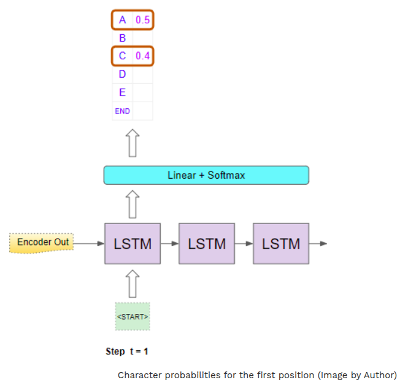
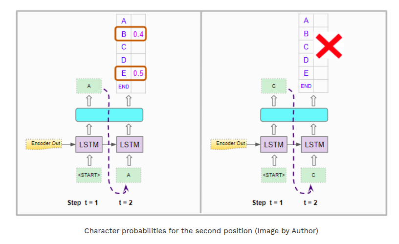
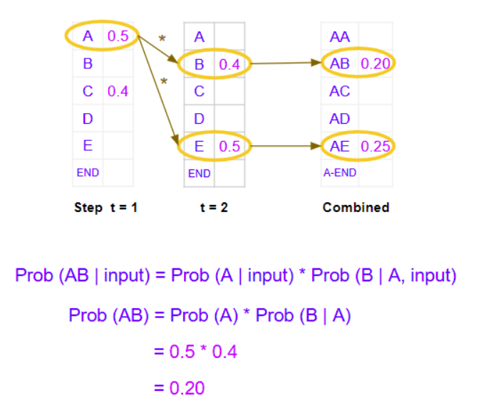
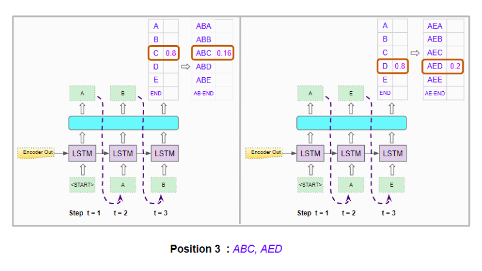
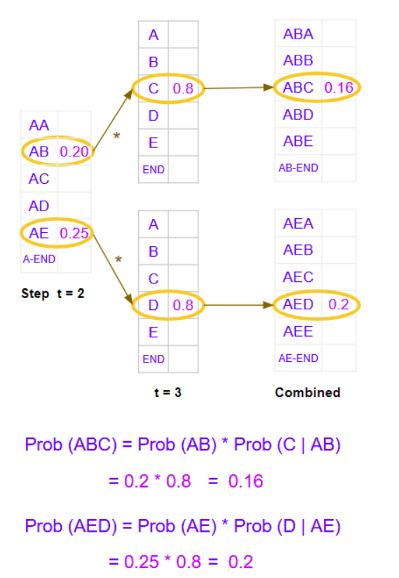

# Beam Search and why do we need it ?

Lets consider a sequence to sequence model to translate english to spanish.
e.g. it takes "You are welcome" in english and outputs the equivalent target language (spanish) sentence translation - "De nada".

We have constructed a vocabulary consisting of the entire set of words in source and target languages.
model takes the source sentence -> passes it through an embedding layer -> followed by an encoder -> outputs and encoded representation.
This representation is then fed to a decoder along with a "" (blank/empty) token to seed its output.
Decoder uses these (the empty token and the encoded representation of the source language) to generate its own encoded representation of
the sentence in the target language.
This is then passed through an output layer -> some linear layers -> softmax
Linear layers output a score of the likelihood of occurence of each word in the vocabulary, at each position in the output sequence.
The softmax then converts those scores into probabilities.
Our goal is not these probabilities but a final target sequence, for that the model has to decide which word it should predict for each
position in that target sequence.

Greedy Search:
Take the word that has the highest probability at each position and predict that.
Quick and easy.

Beam Search:
Why better?
1. With Greedy search, we took just the single best word at each position. 
In contrast, Beam search expands this and takes the best 'N' words.

2. With Greedy search, we considered each position in isolation. Once we had identified the best word for that position, we did not examine
what came before it (i.e. in the previous position) or after it.
In contrast, BS picks the 'N' best sequences so far and considers the probabilities of the combination of all of the preceding words along
with the word in the current position.
Hyperparameter 'N' is known as the Beam Width.

Intuitively it makes sense that this gives us better results over greedy search. Because, we are interested in the best complete sentence, 
and we might miss that if we picked only the best individual word in each position.


## How it works
We'll take this example of sequence-to-sequence model, in which the encoder decoder would contain LSTM layers.
Let the Beam width be 2.

**In the 1st step:**

Model uses the encoder's output and an input of ""(empty) token to generate the character probabilities for the 1st position.
Now it picks 2 characters with the highest probability e.g. "A" and "C".

**In the 2nd step:**
It runs the decoder twice using the encoder's output. 
Along with the "" token in the 1st position, it enforces the input of the second position to be "A" in 1st decoder run.
In the 2nd decoder run, it enforces the input of the second position to be "C".

It generates character probabilities for the 2nd position, but these are individual  character probabilities. We need combined probabilities
for character pairs in the 1st two positions. 


```math
Prob(AB | input) = Prob(A | input) * Prob(B | A,input)
Prob(AB) = Prob(A) * Prob(B | A)
         = 0.5 * 0.4
         = 0.20
```

It does this for both decoder runs and picks the character pairs with the highest combined probabilities across both runs.
Lets say it picks "AB" and "AE".

**In 3rd step:**
It runs the decoder twice as before. 
Along with the "" token in the 1st position, it forces the input of the 2nd and 3rd position to be "A" and "B" in the 1st decoder run.
In the 2nd decoder run, it forces the input of the 2nd and 3rd position to be "A" and "E" respectively.


It then calculates the combined probability for character triples in the 1st 3 positions.
```math
Prob(ABC) = Prob(AB) * Prob(C | AB)
Prob(AED) = Prob(AE) * Prob(D | AE)
```


It picks the 2 best ones across both runs, and then picks "ABC" and "AED".

**Repeat till END token:**
It repeats this process till it generates 2 best sequences that end with an "" token.

It then chooses the sequence that has the highest combined probability to make it's final prediction.
