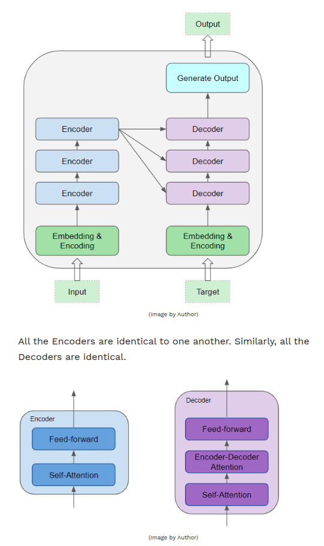
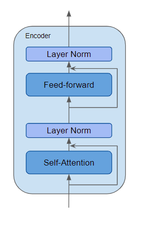
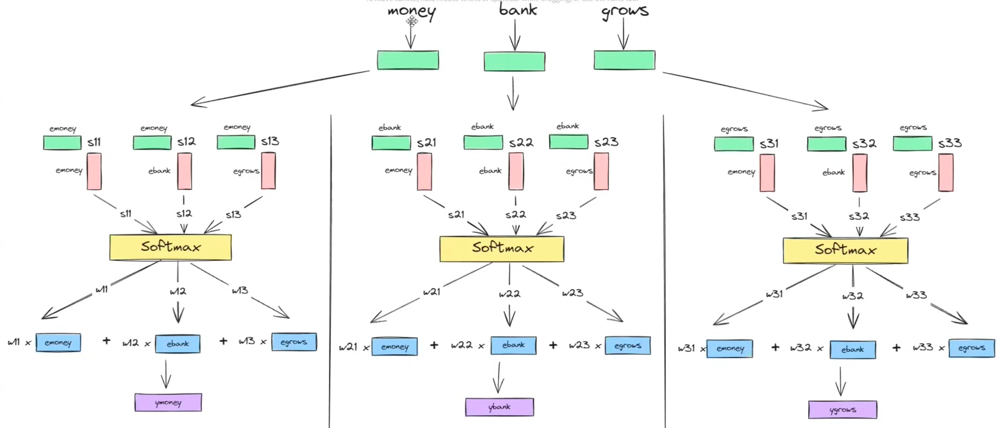
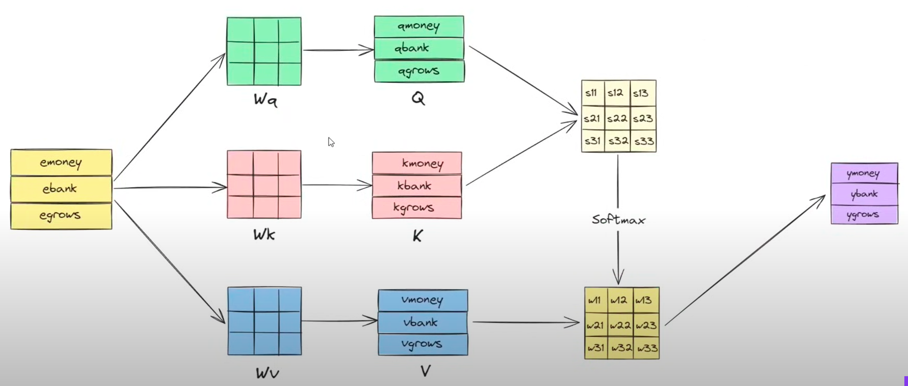

Transfer Learning the word embeddings:
1. Basically take a pretrained word embedding model that is trained on a very large corpus (1B - 100B words or maybe more).
2. Then use this pretrained model and train it on a new task with a smaller training set of your use case (100k). 
(For me, I can maybe train it on the logs data).
3. (optional) Continue to finetune the word embedding with new data.

# Transformer Overview
It excels at handling text data which is inherently sequential.
E.g. language translation

At it's core it contains stack of encoder layers and decoder layers.

The encoder stack and decoder stack each have their corresponding Embedding layers for their respective inputs.
Follwed with an output layer to generate the final output.
All encoders and decoders are identical to one another.

- Encoder contains the self-attention layer that computes the relationship between different words in the sequence, and feed-forward layer.
- Decoder contains the self-attention and the feed-forward layer, as well as a 2nd encoder-decoder attention layer.
- each encoder and decoder has it's own set of weights.

Encoder is a reusable module that is the defining component of all transformer architectures.
In addition to the above 2 layers, it also has residual skip connections around both layers along with 2 LayerNorm layers.
[More on LayerNorm](./pytorch/torch_nn.md)

There are many variations of the transformer architecture.

## What does Attention do?
Attention enables the model to focus on other words in the input that are closely related to that word.

"The boy is holding a blue ball."
The word 'ball' is closely related to 'blue' and 'holding'. But, 'blue' is not related to 'boy'.
Transformer uses self-attention by relating every word in the input sequence to every other word.

For example we have 2 sentences:
1. The cat drank the milk because it was hungry.
2. The cat drank the milk because it was sweet.
In the 1st sentence, the word 'it' refers to 'cat', while in the second it refers to 'milk'. When the model processes the word 'it',
self-attention gives the model more info. about its meaning so that it can associate 'it' with the correct word.

To handle multiple nuances about the intent and semantics of the sentence, Transformers include multiple attention scores for each word.
e.g. While processing the word 'it', the 1st score highlights 'cat', while the 2nd score highlights 'hungry'. So, when it decodes the word
'it', by translating it into a different language, for instance, it will incorporate some aspect of both 'cat' and 'hungry' into the
translated word.

Another perspective of understanding self-attention:
We know that we have fixed/static embeddings of all words in our vocabulary and it is learnt by the embedding models trained on large corpus
of text. This embedding has learnt different aspects of a word, from many different examples and creates a fixed size (n-dimensional) vector.
But these word embeddings have a problem of "Average Meaning":
For example our corpus includes sentences like these in the training dataset (corpus):
1) An apple a day keeps the doctor away.
2) Apple is healthy.
3) Apple is better than orange.
4) Apple makes great phones.

These sentences are sent to the word embedding model which gives a vector like "[x y]" of the input sequence.
We can assume that one variable x can represent some aspect like taste and the other variable y can represent teh technologyt aspect.
So when the input sentences like the ones mentioned above are passed to the model, it makes changes to the vector embedding of each word,
as it learns from the examples. So initially when the 1st 3 sentences are passed, the word Apple in those sentences refer to the fruit, so 
accordingly it make changes in that aspect of the vector, and when it gets the last input sentence, over there "Apple" refers to the brand, so
it makes little change in that aspect of the vector. So, in real life datasets if we have maybe 10000 sentences in which apple was mentioned
and out of that 9000 sentences refered Apple as a fruit then the embedding model will give more weight to the fruit aspect, and maybe only 900
sentences have referred apple as a brand, so there will be relatively less weight to that aspect of the word.
So now this embedding that we receive for each word after training is a consolidation (Average) of all examples or aspects of that word, and
since the dataset had less examples of "Apple" as a brand so the embedding has less weightage in that aspect.
So we can conclude that, how the word embedding will look depends on the data that the model is being fed, as it represents the average 
meaning of the word from the entire dataset into a vector.

The problem now is that the word embeddings are static, i.e. once it is created, the same embedding will be used everytime and won't change.
For example, I have a NLP task of translation from English to Hindi and here is the sentence: 
"Apple released a new product while I was eating an orange yesterday"
The 1st step will be to convert all the words into there respect embeddings. Now the embedding of the word apple which we got from the above
embedding model assumes that word to be a fruit, as it has more weight in that aspect of the word. 
Now we want contextual embedding and not a static one, we want the embedding to represent the word vector based on the input sequence's 
context. 
To solve this problem we have self-attention. It takes the static word embeddings of all the words in the input sequence and gives out smart
contextual word embeddings or encoded representation of the words which are dynamic based on the context.

## Working of Self-Attention
Self-Attention in a way converts the static word embeddings to dynamic contextual word embeddings.

Here from the image we can understand that we have 3 static word embeddings which have no contextual info in them.
So, to make them aware of the context, we can do weighted sum of these embeddings, so that each word has a new embedding which has context of 
all the other words in the sentence.
e.g. "Money bank grows"
e_money_new = 0.7 e_money + 0.2 e_bank + 0.1 e_bank
here the we get those coefficients from the dot products of those embeddings, as it gives the similarity between 2 vectors.
e_money.e_money_T = 0.7     this indicates similarity between the money embeddings itself
e_money.e_bank_T = 0.2      similarity between e_money and e_bank
e_money.e_grows_T = 0.1
These numbers are basically dot products between word embeddings which is basically quantifying the similarity between all the embeddings in
the sequence.
We take these scalar values and pass them to a softmax function which then basically normalizes/scales them, which are then used as weights 
for each embedding further on.
Doing the same thing for all the word embeddings in a sequence, we get new vectors for each word.

One of the main problem in this, is that there are no learnable parameters involved here.
The contextual embeddings that we tried to generate here is a general context embedding and will not be able to adapt to special cases quickly
We need task-specific contextual embeddings which this above implementation will not be able to give as they are not learning with new data.

Now to solve this task-specific contextual embedding problem, lets look at the above diagram again.
We can notice that each word embedding plays 3 major roles, i.e. as a Query, Key and the Value.
The intuition:
We are taking 1 embedding and doing a dot product with all the other embeddings. It is basically indicating that the 1st word embedding is
querying the other embeddings in a sequence, that how much similarity do they have. All the other embeddings play the role of keys and then
the resultant normalized scalar values are used as weights and multipled with the value embedding.  
Each embedding plays 3 different roles in the process of finding the contextual embedding, to do so we do a transformation of the embedding by
multiplying them with learnable parameters (basically performing linear transformation). The reason for needing 3 different vectors is because
we need separation of concern, we want different vectors to handle different concerns like querying and other stuff.

The process of splitting a single vector into 3 different components is through linear transformation, i.e. multiplying the vector with a
matrix. This matrix is called weights matrix (learnable parameters) which will be learnt during the process of training as data is being 
passed and then backpropagated and accordingly the weights are adjusted everytime.

Once we have split the static word embeddings into 3 different vector embeddings i.e. key, query and value, we then go through the same steps.
Q.K_T (dot product b/w query and key vectors)
then divided by sqrt(d_k) - to normalize the values and get low variance
the resultant is passed through a softmax and then multiplied with the value vector.

The matrix dimensionalities are as follows:
if we have 3 word embeddings of n-dimension each 
then our input matrix will be 3xn
accordingly we will have 3 weights matrices W_k, W_q and W_v of nxn dim.
after matrix multiplication of input matrix with weights, we will get 3 matrices Q, K and V each of 3xn dim
Then we perform a dot product of Q and K_T (K transpose matrix) which will return a 3x3 matrix
which then goes through a softmax operation and then mutiplied with the V matrix and give 3xn dim contextual embedding matrix.

Attention(Q, K, V) = softmax(Q.K_T/sqrt(d_k))V

The reason we divide by sqrt(d_k) is so that we don't have unstable gradients.
d_k here is the dimension of the key vector i.e. the result we get after multiplying the word embedding with Key Weight Matrix.
d_k = n
So basically dividing each value in the resultant matrix by sqrt(n).
Why we are doing this?
The result we get after doing the dot product of the Q and K_T matrices is a 3x3 matrix in our example case, in which each number is a sum of
n numbers approx if we look closely into the dot product calculation.

# Training the Transformer
It works slightly differently during training and while inferencing.

## Training
flow of data during training, training data consists of 2 parts:
- The source or input sequence
- The destination or target sequence
Goal - to output target sequence, using both input and target sequence

The transformer processes data like this:
1. Input sequence converted into embeddings (with position encoding) and fed to encoder.
2. Stack of encoders processes this and produces an encoded representation of the input sequence.
3. The target sequence is prepended with a start-of-sentence token, converted into embeddings (with position encoding), and fed to decoder.
4. Stack of decoders processes this along with the encoder stack's encoded representation to produce an encoded representation of the
target sequence.
5. Output layer converts it into word probabilities and the final output sequence.
6. The Transformers loss function compares this output sequence with the target sequence from the training data. This loss is used to generate
gradients to train the transformer during back prop.

## Inference
In this phase we have only the input sequence and no target sequence to pass as input to the decoder.
Goal - produce the target sequence from the input sequence alone.
Difference from seq2seq => at each timestep, we re-feed the entire output sequence generated thus far, rather than just the last word.

Flow of data during inference:
1. Input sequence converted into embeddings (with position encoding) and fed to encoder.
2. Stack of encoders processes this and produces an encoded representation of the input sequence.
3. Instead of the target sequence, we use an empty sequence with only a start-of-sentence token. This is converted into embeddings (with 
position encoding) and fed to decoder.
4. Stack of decoders processes this along with the encoder stack's encoded representation to produce an encoded representation of the target.
5. Output layer converts it into word probabilities and produces an output sequence.
6. We take the last word of the output sequence as the predicted word. That word is now filled into the 2nd position of our decoder input
sequence, which now contains a start-of-sentence token and the 1st word.
7. Go back to step #3. As before, feed the new decoder sequence into the model. Then take the 2nd word of the output and append it to the
decoder sequence. Repeat until it predicts an end-of-sentence token. 
Note: since encoder dequence does not change for each iteration, we do not have to repeat steps #1 and #2.

