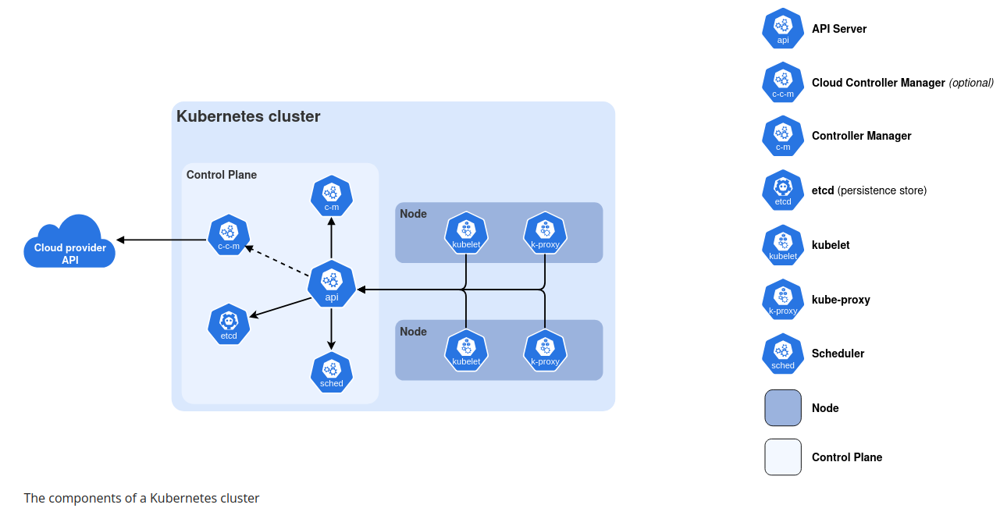
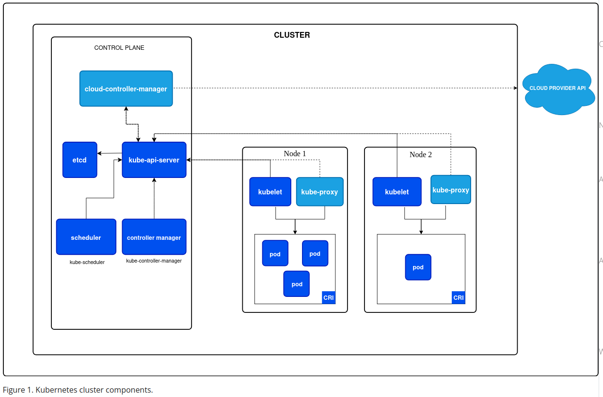

# Kubernetes Components

This is a high-level overview of the components that make up a kubernetes cluster.
Kubernetes cluster consists of a control plane and 1 or more worker nodes.

# Cluster Architecture

K-cluster consists of a control plane plus a set of worker machines, called nodes, that run containerized applications.
Every cluster needs at least 1 worker node in order to run Pods.

- The worker nodes host the Pods that are the components of the application workload.
- Control plane manages the worker nodes and the pods in the cluster.
Note: In prod, control plane usually runs across multiple computers and a cluster usually runs multiple nodes - for HA and Fault tolerance.

## Control Plane (CP) Components
Main role of control plane is to manage the overall state of the cluster.
It's components make global decisions about the cluster - e.g. scheduling, as well as detecting and responding to cluster events.
- e.g. starting a new pod when a deployment's `replicas` field is unsatisfied.

Note: Control plane components can be run on any machine in the cluster, but for simplicity, setup scripts typically start all control
plane components on the same machine, and do not run user containers on this machine.
To setup CP that runs across multiple machine see - HA clusters with kudeadm example.

1. **kube-apiserver**:
- It exposes the Kubernetes API, It is the front end for the kubernetes control plane.
- designed to scale horizontally - that is, it scales by deploying more instances.
- can run several instances of kube-apiserver and balance traffic between those instances.

2. **etcd**:
- Consistent and highly-available key value store used as kubernetes' backing store for all cluster data.
Note: If using etcd as backing store for the K-cluster, make sure to have a backup plan for the data.
[link](https://kubernetes.io/docs/tasks/administer-cluster/configure-upgrade-etcd/#backing-up-an-etcd-cluster)

3. **Kube-Scheduler**:
- CP component that watches for newly created Pods with no assigned nodes, and selects a node for them to run on.
- Decision making factor for scheduling:
    - Individual and collective resource requirements
    - hardware/software/policy constraints
    - affinity and anti-affinity specifications
    - inter-workload interference
    - deadlines

4. **kube-controller-manager**:
- CP component that runs controller processes.
- Logically, each controller is a separate process, but to reduce complexity, they are compiled into a single binary
and run in a single process.
- There are many different types of controllers, some examples of them are:
    - Node controller - noticing and responding when nodes go down
    - Job controller - Watches for job objects that represent one-off tasks, then creates Pods to run those tasks to completion.
    - EndpointSlice controller - Populates EndpointSlice objects (to provide a link between services and pods).
    - ServiceAccount controller - create default ServiceAccounts for new namespaces.

5. **cloud-controller-manager**:
K-CP component that embeds cloud-specific control logic.
- It allows us to link our cluster into cloud provider's API, and separate out the components that interact with that cloud
platform from components that only interact with our cluster.
- cloud-controller-manager only runs controller that are specific to the cloud provider.
There is no CCM in learning env or on-premises
- Similar to kube-controller-manager, it combines several logically independent control loops into a single binary that is run as a single process.
- Can scale horizontally (run more than 1 copy) to improve performance or to help tolerate failures.

Controllers that can have cloud providers dependency:
- Node controller: For checking the cloud provider to determine if a node has been deleted in the cloud after it stops responding.
- Route controller: for setting up routes in the underlying cloud infrastructure.
- Service controller: for creating, updating and deleting cloud provider load balancers.

## Node Components
- runs on every node, maintaining running pods and providing the kubernetes runtime environment.

1. **kubelet**:
- An agent that runs on each node in the cluster - makes sure that containers are running in a Pod.
- It takes a set of PodSpecs and ensures that the containers described in those PodSpecs are running and healthy.
- It does not manage containers which were not created by kubernetes.

2. **kube-proxy**:
- It is a network proxy that runs on each node - implementing part of the kubernetes Service concept.
- maintains network rules on nodes. - these rules allow network communication to the Pods from network sessions
inside or outside of your cluster.
- It uses the OS packet filtering layer if there is one and it's available.
Otherwise, kube-proxy forwards the traffic itself.
- Can use some network plugin as well if it provides equivalent service.

3. **Container runtime**:
- responsible for managing the execution and lifecycle of containers within the kubernetes environment.
- kubernetes supports containerd, CRI-O and other implementation of Kubernetes CRI (Container Runtime Interface).

## Addons

