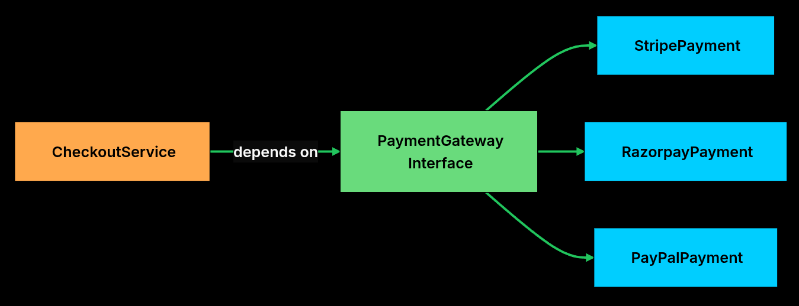
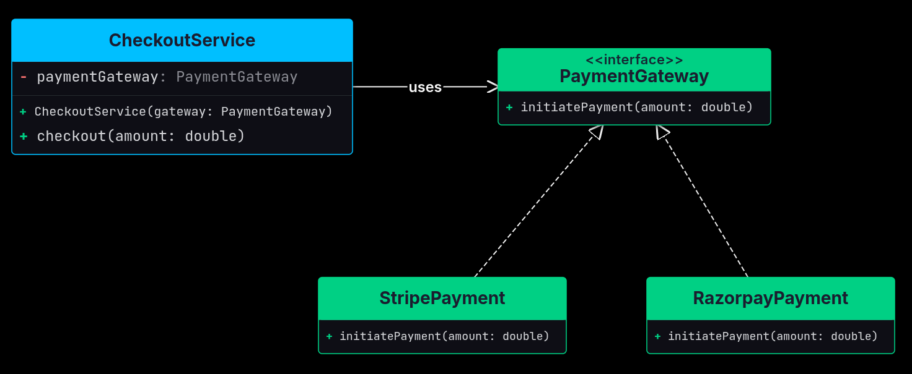
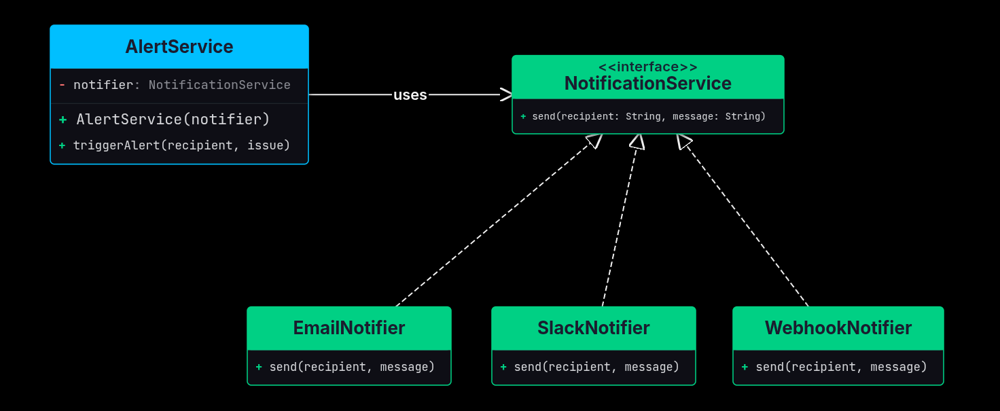

# Interfaces
- They define **what** a component should do, **not how** it should do it.
- This separation of definition and implementation allows different parts of the system
to work together through well-defined contracts, without needing to know each others internal details.

## What is an Interface
- At its core, an *interface* is a **contract**: list of methods that any implementing class must provide.
- It specifies a set of behaviors that a class agrees to implement but leaves the details of those behaviors
up to each implementation.

Analogy:
Consider a remote control. It exposes a standard set of buttons:
- play()
- pause()
- volumeup()
- volumedown()
- poweroff()
- poweron()

The person using the remote doesn't care if it controls a TV, Soundbar, or a projector, they all understand the same set of commands.

The remote is the interface. The device (TV, soundbar, projector) are the implementations.
Each device behaves differently when you press `play()`, but the contract remains consistent.

## Key Properties
Interfaces are more than just method declarations, they are the foundation of flexible software design.
1. Defines behavior without dictating implementation - only declares *what operations* are expected, it doesn't define how they are
carried out.
Gives freedom to implementers to provide their own version of the logic, while still honoring the same contract.

2. Enables Polymorphism - Different classes can implement the same interface in different ways. Allows code to work with multiple
implementations interchangeably.

3. Promotes Decoupling - code that depends on interfaces is insulated from changes in the concrete classes that implement them.
This makes code easier to: Extend, Test, and Maintain.

Example:


As long as all payment providers implement the `PaymentGateway` interface, the `CheckoutService` can use any
of them without changing its own code.

## Code
We're designing a payment processing module that supports multiple providers like stripe, razorpay, and paypal.
We don't want the business logic to depend on a specific provider. We want a common way to initiate a payment.

```python
from abc import ABC, abstractmethod

class PaymentGateway(ABC):
  @abstractmethod
  def initiate_payment(self, amount):
    pass
```

This interface defines the contract. Every payment gateway must provide a `initiate_payment()` method.
But it doesn't specify how each provider processes payments.



```python
class StripePayment(PaymentGateway):
  def initiate_payment(self, amount):
    print(f"Processing payment via Stripe: ${amount}")

class RazorpayPayment(PaymentGateway):
  def initiate_payment(self, amount):
    print(f"Processing payment via Razorpay: Rupee {amount}")
```

Both implemented the same interface, but their internal logic is completely different.
`StripePayment()` talks to the stripe API, `RazorpayPayment()` talks to the Razorpay api.
The interface guarantees that both provide the `initiate_payment()` method, so any code that depends on `PaymentGateway()` can
work with either one.

```python
class CheckoutService:
  def __init__(self, payment_gateway):
    self.payment_gateway = payment_gateway

  def set_payment_gateway(self, payment_gateway):
    self.payment_gateway = payment_gateway

  def checkout(self, amount):
    self.payment_gateway.initiate_payment(amount)
```

This interface simply decouples the service from any specific provider.

## Notification Service Example



```python
from abc import ABC, abstractmethod

class NotificationService(ABC):
  @abstractmethod
  def send(self, recipient: str, message: str) -> None:
    pass

class EmailNotifier(NotificationService):
  def send(self, recipient: str, message: str) -> None:
    print(f"[Email] To: {recipient} | {message}")

class SlackNotifier(NotificationService):
  def send(self, recipient: str, message: str) -> None:
    print(f"[Slack] Channel: {recipient} | {message}")

class WebhookNotifier(NotificationService):
  def send(self, recipient: str, message: str) -> None:
    print(f"[Webhook] URL: {recipient} | {message}")

class AlertService:
  def __init__(self, notifier: NotificationService):
    self._notifier = notifier

  def trigger_alert(self, recipient: str, issue: str) -> None:
    alert_message = f"ALERT: {issue}"
    self._notifier.send(recipient, alert_message)


if __name__ == "__main__":
  email_alerts = AlertService(EmailNotifier())
  email_alerts.trigger_alert("ops@company.com", "CPU usage at 95%")

  slack_alerts = AlertService(SlackNotifier())
  slack_alerts.trigger_alert("#incidents", "Database connection pool exhausted")

  webhook_alerts = AlertService(WebhookNotifier())
  webhook_alerts.trigger_alert("https://hooks.example.com/alerts", "Disk usage at 90%")
```

