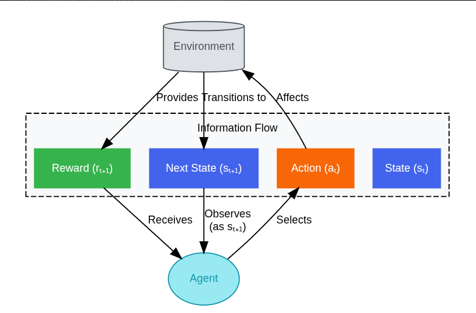

# Reinforcement Learning
Type of ML where an artificial agent learns to make decisions by interacting with an
environment.
Agent takes action within environment, in return receives feedback in the form of rewards
(or penalties) and info. about the env's current state.
The fundamental goal of the agent is not simply to get the highest immediate reward, but to
learn a strategy, known as *policy*, that maximizes the total accumulated reward over the
long run.

## RL vs Supervised Learning
In SL, the algo. learns from a dataset - each example corresponds to a "correct" output or label.
Goal is to learn a mapping function that can predict the output for new, unseen inputs.
The feedback is *instructive*; it tells the algo. exactly what the correct answer should have been.

In RL - no explicit labels.
The feeback is *evaluative*; the reward signal only indicates how good the action taken was in that
state, not whether it was the best or what the best possible action would have been.
Agent discovers effective actions through exploration and exploitation of its past experiences.
Decision are sequential.

## Agents and Environments
2 primary components: Agent and Environment
Agent - the learner or decision-maker, the entity that we are training.
  Goal is typically to maximize cumulative reward over time.
  perceives env's current situation(state), and based on this state selects an action to perform.
  The agents internal mechanism for choosing actions based on states is called *policy*.

Environment - represents everything the agent interacts with.
  It receives agents action, responds by transitioning to a new state and providing a numerical
  reward signal.
  Env defines the "rules of the game" or the physics the agent operates within.

The environment is repsonsible for:
1. Presenting the current state to the agent.
2. Defining available actions: defining what the agent can do in a given state.
3. Calculating state transitions: Determining next state based on the current state and the agent's
action. This transition might be deterministic.
4. Providing the rewards: Sending a scalar feedback signal to the agent indicating the immediate
desirability of the transition.

## Agent-Environment Interaction Loop
At each discrete time step *t*, the following sequence occurs:
1. **Observation**: agent observes current state of the env, *St*
2. **Action Selection**: Based on observed state *St*, agent selects an action *At* according to its policy.
3. **Environment Response**: Environment receives action *At*. Based on *St* and *At*, the env transitions
to a new state, *St+1*.
4. **Reward Feedback**: Env provides a reward signal, *Rt+1*, to agent as feedback for the transition.
5. **Learning**: Agent uses Observed transitions (*St, At, St+1, Rt+1*) to update it's internal knowledge
or policy, aiming to make better decisions in the future.

Note: Reward computation mechanism is a part of the env, not the agent.
The agent learns a *policy* to interact optimally with the dynamics and reward structure defined by
the environment.
