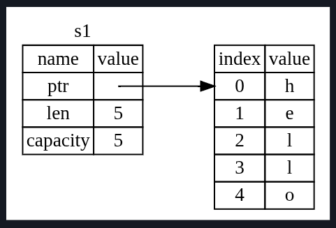
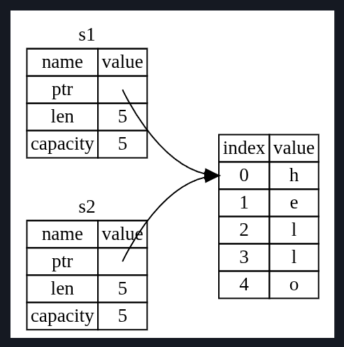
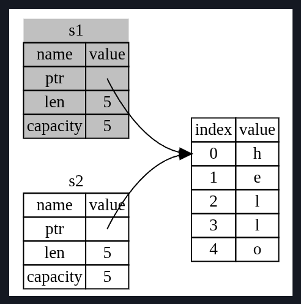
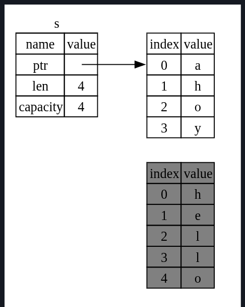

# Ownership
Ownership - set of rules that govern how a Rust program manages memory.
All programs have to manage the way they use the computer's memory while running.
Some languages have garbage collection that regularly looks for no-longer-used memory as the program runs;
in other languages, the programmer must explicitly allocate and free the memory.

- Rust uses a third approach: Memory is managed through a system of ownership with a set of rules that the compiler checks.
If any of the rules are violated the program won't compile.

## The Heap and Stack
For a systems programming language like Rust, it is important to know and decide whether the value is on the stack or heap,
as it affects how the language behaves and why you have to make certain decisions.

Stack and Heap are parts of the memory available for our code to use at runtime.
Stack - stores value in the order it gets them and removes value in opposite order - First In Last Out (FILO) / Last In First Out (LIFO).
Adding data - *pushing on to the Stack*, removing data - *popping off the stack*.
All data stored on the stack must have a known, fixed size.
Data with an unknown size at compile time or a size that might change must be stored on the heap.

Heap is less organized: when you put data on a heap, we have to request a certain amount of space.
The memory allocator finds an empty spot in the heap that is big enough, marks it as being in use, and returns a pointer, which
is the address of that location - process is called allocating on the heap
Because the pointer to the heap is known, fixed size, we can **store the pointer on the stack, but when we want the actual data, we
must follow the pointer**.

Pushing to the stack is faster than allocating on the heap because the allocator never has to search for a place to store new data;
that location is always at the top of the stack.
Comparatively, allocating space on the heap requires more work because the allocator must first find a big enough space to hold that data,
and then perform bookkeeping to prepare for the next allocation.

Accessing data in the heap is generally slower than accessing data on the stack because we have to follow a pointer to get there.
Contemporary processors are faster if they jump around less in the memory.
When your code calls a function, the values passed into the function (including, potentially pointers to data on the heap), and the
function's local variables get pushed onto the stack.
When the function gets over, those values are popped off the stack.

- Keeping track of what parts of code are using what data on heap, minimizing the amount of duplicate data on the heap, and cleaning
up unused data on the heap so that we don't run out of space are all problems that ownership addresses.
Main purpose of ownership is to manage heap data.

## Ownership Rules

> - Each Value in Rust has an *Owner*.
> - There can only be one owner at a time.
> - When the owner goes out of scope, the value will be dropped.

## Variable Scope
A scope is the range within a program for which that item is valid.

```rust
{                       // s is not valid here, since it's not yet declared
    let s = "hello";    // s is valid from this point onwards

    // do stuff with s
}                       // this scope is now over, s is no longer valid
```
The variable `s` refers to a string literal
The variable is valid from the point at which it's declared until the end of the current scope.

There are 2 important points here:
- when `s` comes into scope, it is valid.
- It remains valid until it goes out of scope.

## String Type
The previous types that we have seen till now have a known fixed size, which can be stored on the stack and popped off the stack
whenever their scope is over, and can quickly and trivially be copied to make a new independent instance if another part of the program
needs to use the same value in a different scope.
But we want to look at a data now which is stored on the heap, which is growable, so that we can see how Rust knows when to clean up that
data, for this `String` type is a great example.

The variable we saw above in the variable scope example was a string literal wherein the value was hardcoded in the program itself.
They are immutable. If we want to accept user input whose size we do not know and store that input text, in such cases String is the
type that we should use.
This type manages data allocated on the heap and as such is able to store an amount of text that is unknown to us at compile time.

`let s = String::from("hello");`
The double colon `::` operator allows us to namespace this particular `from` function under the `String` type rather than using some sort
of name like string_from. (more in chp 5 and 7)

## Memory and Allocation
With the String type, in order to support a mutable, growable piece of text, we need to allocate an amount of memory on the heap,
unknown at compile time, to hold the contents. This means:
- The memory must be requested from the memory allocator at runtime.
- Then need a way of returning this memory to the allocator when done using it.

When we call the `String::from()` its implementation automatically request it from the heap.
But for the 2nd part, in languages with *garbage collector (GC)*, the Gc keeps track of and cleans up the memory that isn't being used.
In most languages without GC, it is our responsibility to identify when the memory is no longer required and to call the code to
explicitly free it. It is important to pair exactly one `allocate` with exactly 1 `free`.

Rust takes a different path: **The memory is automatically returned once the variable that owns it goes out of scope.**
```rust
{
    let s = String::from("hello");    // s is valid from this point onwards

    // do stuff with s
}                                     // the scope is now over, and s is no longer valid.
```
There is a natural point at which we can return the memory our `String` needs to the allocator: when `s` goes out of scope.
When the variable goes out of scope - rust calls special function `drop` to return the memory.
It is automatically called at the closing curly brackets.

### Varibales and Data interacting with Move
```rust
let x = 5;
let y = x;
```
Here we bind value 5 to x, and then make a copy of the value of x and bind it to y.
We now hae 2 variables x and y both = 5.
Integers are fixed, known sizes, which we can easily push onto the stack.

Now lets look at the `String` version:
```rust
let s1 = String::from("hello");
let s2 = s1;
```
This looks similar and we might assume that the same thing is happening but **NO**.

A `String` is made up of 3 parts:


- a pointer to the memory that holds the contents of the string,
- length: memory in bytes, the content of the `String` are currently using.
- capacity: total amount of memory in bytes, that the string has received from the allocator.

This group of data is stored on the stack. On the right side of the image is the memory on the heap that holds the contents.

When we assign `s1` to `s2`, the String data is copied, meaning we copy the pointer, length and capacity that are on the stack.
We do not copy the data on the heap that the pointer refers to.

So data representation in the memory looks like this:


Earlier we said that when a variable goes out of scope, rust automatically calls the `drop` function and cleans up the heap memory
for that variable.
We see that both data pointers pointing to the same location. Now the problem is, when `s1` and `s2` goes out of scope, they both will call
`drop` and try to free the same memory. This is known as *double free* error and is one of the memory safety bugs mentioned previously.
Freeing memory twice can lead to memory corruption, which can potentially lead to security vulnerabilities.

To ensure memory safety, after the line `let s2 = s1;`, Rust considers `s1` to be no longer valid.
Therefore, Rust doesn't need to free anything when `s1` goes out of scope.
If we try to use s1 after that s2=s1 statement we will get an error:
```
$ cargo run
   Compiling ownership v0.1.0 (file:///projects/ownership)
error[E0382]: borrow of moved value: `s1`
 --> src/main.rs:5:16
  |
2 |     let s1 = String::from("hello");
  |         -- move occurs because `s1` has type `String`, which does not implement the `Copy` trait
3 |     let s2 = s1;
  |              -- value moved here
4 |
5 |     println!("{s1}, world!");
  |                ^^ value borrowed here after move
  |
  = note: this error originates in the macro `$crate::format_args_nl` which comes from the expansion of the macro `println` (in Nightly builds, run with -Z macro-backtrace for more info)
help: consider cloning the value if the performance cost is acceptable
  |
3 |     let s2 = s1.clone();
  |                ++++++++

For more information about this error, try `rustc --explain E0382`.
error: could not compile `ownership` (bin "ownership") due to 1 previous error
```

We can relate this with shallow copy, as we are copying the pointer, length and capacity without copying the data.
But because rust also invalidates the first variable, instead of being called a shallow copy it is known as **move**.
In this example we would say that `s1` was moved into `s2`.


In addition there is a design choice thats implied by this: Rust will never automatically create "deep" copies of your data.
Therefore, any automatic copying can be assumed to be inexpensive in terms of runtime performance.

### Scope and Assignment
When we assign a completely new value to an existing variable, Rust will call `drop` and free the original value's memory immediately.
Example:
```rust
    let mut s = String::from("hello");
    s = String::from("Ahoy");

    println!("{s}, world!");
```
This is what happens:


The original string thus immediately goes out of scope. Rust will run the `drop` function on it and its memory will be freed right away.
Output will be: "Ahoy, world!"

### Variables and Data Interacting with Clone
If we do want to deeply copy the heap data of the String and not just the stack data, we can use a common method called `clone`.
Example:
```rust
    let s1 = String::from("hello");
    let s2 = s1.clone();

    println!("s1: {s1}, s2: {s2}");
```
But we should be aware that when we see a call to clone(), we know that some arbitrary code is being executed and that code may be
expensive. It's a visual indicator that something different is going on.

### Stack-Only Data: Copy
Now the previous code of integers that we saw earlier:
```rust
    let x = 5;
    let y = x;

    println!("x: {x}, y: {y}");
```
Here we didn't have to call clone, but x is still valid and wasn't moved to y.
Reason - types like integers have a known fixed size at compile time that can be stored entirely on stack. So copies of the actual values
are quick to make. That means there is no reason we would want to prevent x from being valid after we create variable y.
There is no difference between deep and shallow copying here, so calling clone no difference.

Rust has a special annotation called `Copy` trait that we can place on types that are stored on the stack, like integers.
More on traits in chp 10
But if a type implements the Copy trait, variables that use it do not move, but rather are trivially copied, making them still valid
after assignment to another variable.

Rust won't let us annotate a type with `Copy` if the type, or any of its parts, has implemented the `drop` trait.
If the type wants something special to happen when the value goes out of scope and we add the `Copy` annotation to that type, we'll get
a compile-time error.

Any group of simple scalar values can implement `Copy`, and nothing that requires allocation or is some form of resource can implement
`Copy`. Here are some types that implement `Copy`:
- All integer types, such as `u32`.
- Boolean type, `bool`, with values `true` and `false`.
- All floating-point types, such as `f64`.
- Character type, `char`
- Tuples, if they only contain types that implement copy. Example: (i32, i32) implements copy, but (i32, String) does not.


## Ownership and Functions
Mechanics of passing a value to a function are similar to those when assigning a value to a variable.
Passing a variable to a function will move or copy, just as assignment does.
Example:
```rust
fn main() {
    let s = String::from("hello");  // s comes into scope

    takes_ownership(s);             // s's value moves into the function...
                                    // ... and so is no longer valid here

    let x = 5;                      // x comes into scope

    makes_copy(x);                  // Because i32 implements the Copy trait,
                                    // x does NOT move into the function,
                                    // so it's okay to use x afterward.

} // Here, x goes out of scope, then s. However, because s's value was moved,
  // nothing special happens.

fn takes_ownership(some_string: String) { // some_string comes into scope
    println!("{some_string}");
} // Here, some_string goes out of scope and `drop` is called. The backing
  // memory is freed.

fn makes_copy(some_integer: i32) { // some_integer comes into scope
    println!("{some_integer}");
} // Here, some_integer goes out of scope. Nothing special happens.
```
If we tried to use `s` after the call to the `takes_ownership` function, Rust would have thrown a compile-time error.

## Return Values and Scope
Returning Values can also transfer ownership.
Example:
```rust
fn main() {
    let s1 = gives_ownership();        // gives_ownership moves its return
                                       // value into s1

    let s2 = String::from("hello");    // s2 comes into scope

    let s3 = takes_and_gives_back(s2); // s2 is moved into
                                       // takes_and_gives_back, which also
                                       // moves its return value into s3
} // Here, s3 goes out of scope and is dropped. s2 was moved, so nothing
  // happens. s1 goes out of scope and is dropped.

fn gives_ownership() -> String {       // gives_ownership will move its
                                       // return value into the function
                                       // that calls it

    let some_string = String::from("yours"); // some_string comes into scope

    some_string                        // some_string is returned and
                                       // moves out to the calling
                                       // function
}

// This function takes a String and returns a String.
fn takes_and_gives_back(a_string: String) -> String {
    // a_string comes into
    // scope

    a_string  // a_string is returned and moves out to the calling function
}
```
The ownership of a variable follows the same pattern everytime: Assigning a value to another variable moves it.
When a variable that includes data on the heap goes out of scope, the value will be cleaned up by `drop` unless ownership
of the data has been moved to another variable.

While this works, taking ownership and then returning ownership with every function is a bit tedious. What if we want to let a function use
a value but not take ownership? It’s quite annoying that anything we pass in also needs to be passed back if we want to use it again, in
addition to any data resulting from the body of the function that we might want to return as well.

Rust lets us return multiple values using tuples:
```rust
fn main() {
    let s1 = String::from("hello");

    let (s2, len) = calculate_length(s1);

    println!("The length of '{s2}' is {len}.");
}

fn calculate_length(s: String) -> (String, usize) {
    let length = s.len(); // len() returns the length of a String

    (s, length)
}
```

Still too much work for a common concept.
Thats why we have references.
