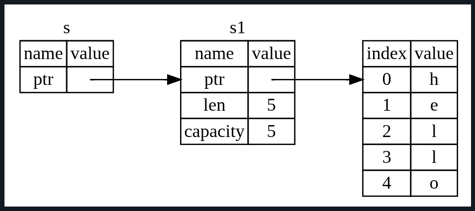

# References and Borrowing
Previously we faced the issue of returning the ownership of the value back to the variable after it was passed to a function.
So to tackle this we had to return multiple values through tuples, which was 1 way of handling it.

Instead we can provide a reference to the String value.
A *reference* is like a pointer in that it's an address we can follow to access the data stored at that address;
that data is owned by some other variable.
refactored example:
```rust
fn main(){
    let s1: string = String::from("hello");
    let l = calculate_len(&s1);

    println!("Length of the string '{s1}' : {l}");
}

fn calculate_len(s: &String) -> usize {
    s.len()
}
```
The point to note here is that we pass `&s1` into `calculate_len()` and, in its definition, we take `&String` rather than `String`.
These ampersands represent references, and they allow you to refer to some value without taking ownership of it.
Here is whats happening:


The `&s1` syntax lets us create a reference that refers to the value of `s1` but does not own it.
When functions have references as parameters instead of actual values, we won't need to return the values in order to give back ownership.
We call the act of creating a reference *borrowing*.

But now if we try to modify something that we borrowed, we will get an error:
```rust
fn main() {
    let s = String::from("hello");

    change(&s);
}

fn change(some_string: &String) {
    some_string.push_str(", world");
}
```
We know that String by default as well is immutable.
Even if you tried to normally append anything to the variable s it would have given an error as to trying to change an immutable variable.
But in this case as well, just as variables are immutable, references as well are immutable by default.
We are not allowed to modify something we have a reference to. Here is the error:
```
$ cargo run
   Compiling ownership v0.1.0 (file:///projects/ownership)
error[E0596]: cannot borrow `*some_string` as mutable, as it is behind a `&` reference
 --> src/main.rs:8:5
  |
8 |     some_string.push_str(", world");
  |     ^^^^^^^^^^^ `some_string` is a `&` reference, so the data it refers to cannot be borrowed as mutable
  |
help: consider changing this to be a mutable reference
  |
7 | fn change(some_string: &mut String) {
  |                         +++

For more information about this error, try `rustc --explain E0596`.
error: could not compile `ownership` (bin "ownership") due to 1 previous error
```

## Mutable References
The above error can be fixed by the following changes:
```rust
fn main() {
    let mut s = String::from("hello");
    change(&mut s);
    println!("The final string: {s}");
}

fn change(some_string: &mut String) {
    some_string.push_str(", world!");
}
```
1st - change s to be `mut`
Then, create mutable reference with `&mut s`, which is then passed to the function, and then make sure to change the function signature
to accept the mutable reference by adding this in the parameter - `some_string: &mut String`
This makes it very clear that the `change` function will mutate the value it borrows.

Mutable reference have 1 big restriction: **If you have a mutable reference to a value, you can have no other references to that value.**
This is important because we cannot have any other reference as well, not even the immutable ones.
Example:
```rust
fn main() {
    let mut s1 = String::from("hello");

    let s2 = &mut s1;
    let s3 = &s1;
    let s4 = &s1;

    s2.push_str("ABC");

    println!("s1: {}", s1);
}
```
Here this code will give an error, lets break this down 1 by 1:
we 1st created a mutable reference of s1 and gave it to s2.
So now s2 has the authority to make changes to s1.
s3 and s4 but have immutable references, so even though it cannot make changes to s1 it is still not allowed to have that reference,
and will give an error on both lines.
This happens because s3 and s4 might be refering to that s1 string and will have some value to it, but later on in the code if s2 makes
any change to the string s1, then the values that s3 and s4 will be refering to will become invalid or outdated cause they have no way
of going back to it again, even if they are just pointing to it, but this creates a possibility of some weird unexpected outcomes, which
can be prevented. So this is like a security measure.
Therefore, if you have created a mutable reference to a value, then no other reference to that value should exist, not even immutable.
Example:
```rust
fn main() {
    let mut s1 = String::from("hello");

    let s2 = &mut s1;
    let r1 = calculate_len(&s1);

    s2.push_str(" Incorrect");

    println!("Length of s1 - {s1}: {}", r1);
}

fn calculate_len(some_string: &String) -> usize {
    some_string.len()
}
```
This is the issue I talked about above, initially the string s1 has the value of hello and length 5.
We gave s2 the mutable reference, and then pass the immutable reference of s1 to the calculate_len function.
Now the function returned r1 as 5 as it was not changed till now, but later using the mutable reference to append to that string.
So this is a security check and preevntion mechanism to prevent that r1 reference to not have an invalid value.
This was the error the compiler would have given during compile time itself:
```
[sahil@Lazarus ownership]$ cargo run
   Compiling ownership v0.1.0 (/home/sahil/rust_projects/ownership)
error[E0502]: cannot borrow `s1` as immutable because it is also borrowed as mutable
 --> src/main.rs:5:28
  |
4 |     let s2 = &mut s1;
  |              ------- mutable borrow occurs here
5 |     let r1 = calculate_len(&s1);
  |                            ^^^ immutable borrow occurs here
6 |
7 |     s2.push_str(" Incorrect");
  |     -- mutable borrow later used here

For more information about this error, try `rustc --explain E0502`.
error: could not compile `ownership` (bin "ownership") due to 1 previous error
```
But we can create multiple simple immutable references.

**All this is to prevent Data races at compile time.**
A *data race* is similar to a race condition and happens when these three behavior occurs:
- Two or more pointers access the same data at the same time.
- At least one of the pointers is being used to write to the data.
- There's no mechanism being used to synchronize access to the data.

Data races cause undefined behavior and can be difficult to diagnose and fix when you're trying to track them down during runtime.
Rust prevents this problem by refusing to compile code with data races.

But but we can use curly brackets to create a new scope, allowing for multiple mutable references, just not simultaneous ones:
```rust
    let mut s = String::from("hello");

    {
        let r1 = &mut s;
    } // r1 goes out of scope here, so we can make a new reference with no problems.

    let r2 = &mut s;
```

Rust enforces a similar rule for combining mutable and immutable references.
```rust
    let mut s = String::from("hello");

    let r1 = &s;
    let r2 = &s; // creating 2 immutable references no problem.
    let r3 = &mut s;   // This is a big problem - error.

    println!("{}, {}, and {}", r1, r2, r3);
```
This code would have resulted in an error as we tried to create a mutable reference to 's' when it already had multiple immutable
references to 's'.
We cannot have a mutable reference while we have an immutable one to the same value.


Users of an immutable reference dont expect the value to suddenly change out from under them!
However, multiple immutable references are allowed because no one who is just reading the data has the ability to affect anyone
else's reading of the data.

**Note**:
A reference's scope starts from where it is introduced and continues through the last time that reference is used.
For instance, in the following code:
```rust
    let mut s = String::from("hello");

    let r1 = &s;
    let r2 = &s;

    println!("{r1} and {r2}."); // variables r1 and r2 will not be used after this point.

    let r3 = &mut s;  // this is no problem now.

    println!("{}", r3);
```
This code will compile because the last usage of the immutable reference is in the `println!`, before the mutable reference is introduced.
The scopes of the immutable references r1 and r2 end after the `println!` where they are last used, which is before the mutable reference
r3 is created.
These scopes dont overlap, so this code is allowed: The compiler can tell that the reference is no longer being used at a point before
the end of the scope.

Also note:
**We cannot even directly access `s` while an exclusive mutable borrow exists.**
Example:
```rust
fn main() {
    let mut s = String::from("hello");
    let r1 = &mut s;
    println!("{}", r1);
    change(r1);
    println!("{}", r1);
    println!("This is s now: {s}");  // this line is the main cause of error.
    change(r1);
    println!("Another time r1: {r1}");
}

fn change(some_string: &mut String) {
    some_string.push_str(", world!");
}
```
This code will give an error because we are trying to directly access `s` while the mutable reference is still active and in scope.
since the compiler knows that r1 is being used later and further will be in scope, therefore the immutable access of s is still invalid,
as the println! will need an immutable read access to print the string `s`.
Now if the last 2 lines of the code were not there i.e. change(r1) and print r1, if are removed then the code will compile because
the compiler can now see that r1's scope has now ended, so an immutable reference can be given to println.

This is where modern rust gets interesting.
**A reference doesn't necessarily live until the end of the variable's lexical scope. Rust uses Non-Lexical Lifetimes (NLL)**.
That means that the compiler tries to determine:
"What is the last place where this reference is actually used ?"

So as I said, the above code will work if the last 2 lines in the main function were removed.
Even this will work:
```rust
fn main() {
    let mut s = String::from("hello");

    let r1 = &mut s;

    println!("{}", r1);

    change(r1);

    println!("{}", r1);

    println!("This is the {s}");

    let r2 = &mut s;

    change(r2);

    println!("This is the second time: {r2}");
}

fn change(some_string: &mut String) {
    some_string.push_str(", world!");
}
```
Despite we create mutiple mutable references of s in the same scope it still works because there lifetimes end before the new is created.
So very important to keep in mind the variable lifetime and borrow lifetime. More in chp 10.

## Dangling References
In languages with pointers, it's easy to erroneously create a *dangling pointer* - a pointer that references a location in memory that
may have been given to someone else - by freeing some memory while preserving a pointer to that memory.

In Rust, compiler guarantees that references will never be dangling references: if we have a reference to some data, the compiler will
ensure that the data will not go out of scope before the reference to the data does.

Example code that creates a dangling reference:
```rust
fn main() {
    let reference_to_nothing = dangle();
}

fn dangle() -> &String {
    let s = String::from("hello");

    &s
}
```

The error:
```
$ cargo run
   Compiling ownership v0.1.0 (file:///projects/ownership)
error[E0106]: missing lifetime specifier
 --> src/main.rs:5:16
  |
5 | fn dangle() -> &String {
  |                ^ expected named lifetime parameter
  |
  = help: this function's return type contains a borrowed value, but there is no value for it to be borrowed from
help: consider using the `'static` lifetime, but this is uncommon unless you're returning a borrowed value from a `const` or a `static`
  |
5 | fn dangle() -> &'static String {
  |                 +++++++
help: instead, you are more likely to want to return an owned value
  |
5 - fn dangle() -> &String {
5 + fn dangle() -> String {
  |

For more information about this error, try `rustc --explain E0106`.
error: could not compile `ownership` (bin "ownership") due to 1 previous error
```

We'll discuss more about lifetimes in chp 10, but the error itself points out the error properly.
From the function `dangle()` we can understand that, because `s` is created inside `dangle`, so when the code of `dangle` finishes,
`s` will be deallocated. But we tried to return a reference to it. That means that this reference will be pointing to an invalid string.

So the solution here would be:
```
fn dangle() -> String {
    let s = String::from("hello");

    s
}
```
This works without any error, as the ownership is moved out and nothing is allocated.
