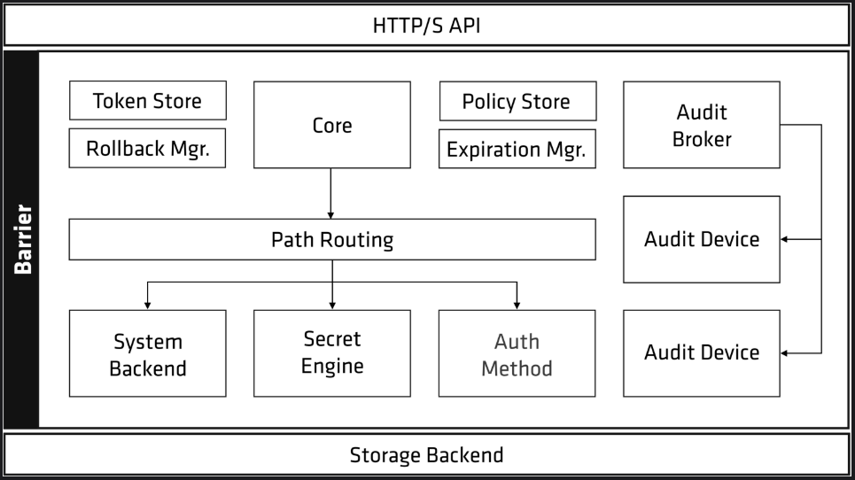

# Architecture
## High-Level Overview

OpenBao's encryption layer, referred to as the **barrier**, is responsible for encrypting and decrypting OpenBao's data.
When the OpenBao server starts, it writes data to its storage backend. Since the storage backend resides outside the
barrier, it's considered untrusted so OpenBao will encrypt the data before it sends them to the storage backend.
This mechanism ensures that if a malicious attacker attempts to gain access to the storage backend, the data cannot
be compromised since it remains encrypted, until OpenBao decrypts the data. The storage backend provides a durable
data persistent layer where data is secured and available across server restarts.

When an OpenBao server is started, it begins in a *sealed* state. Before any operation can be performed on OpenBao,
it must be *unsealed*. This is done by providing the **unseal keys**.
During the OpenBao initialization, it generates an **encryption key**, which is used to protect all OpenBao data.
This key is protected by a **root key** that is stored alongside all other OpenBao data, but is encrypted by another
mechanism: the unseal key.

By default, OpenBao uses *Shamir's Secret Sharing* to split the unseal key into a configured number of shards (key
shares or unseal keys). A precise no. of shards are required to reconstruct the unseal key, which is then used to
decrypt the OpenBao's root key.

Shamir's technique can be disabled, and the root key can be used directly for unsealing.
Once OpenBao retrieves the encryption key, it decrypts the data in the storage backend, and enters the unsealed state.
Once unsealed, OpenBao loads the configured audit devices, auth methods, and secret engines.

Note: default OpenBao configuration uses Shamir's seal; however, OpenBao can be auto-unsealed by a trusted cloud Key
Management System (KMS) or Hardware Security Module (HSM) to increase security.

The configuration of the audit devices, auth methods, and secrets engines are security sensitive and are stored in OB.
Users with permissions can modify them and cannot be specified outside of the barrier. By storing them in OB, changes
are protected by the Access-Control-List (ACL) system and tracked by audit logs.

Requests may be processed from the HTTP API to core once OB is unsealed.
- The core manages the flow of requests through the system, enforces ACLs, and ensures audit logging is done.

When a client 1sr connects to OB, they need to authenticate. OB provides configurable auth methods and offers flexibility
within the authentication mechanism used.
Mechanisms such as usename/pass or Github - for operators
applications use public/private keys or tokens to authenticate.
An authentication request that flows through the core and into an auth method determines if the request is valid
and returns a list of associated policies.

Policies are just a named ACL rule. 
